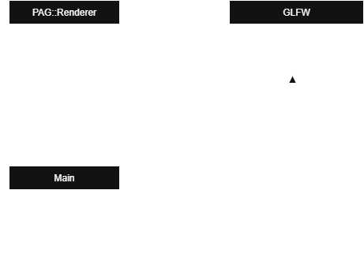
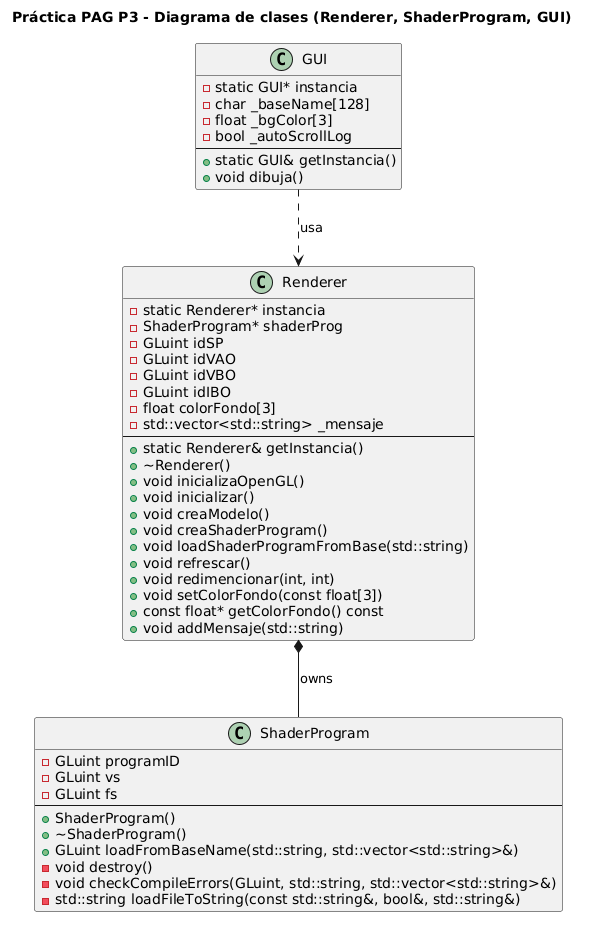

## Posible solución al problema planteado:

En esta práctica se plantea el problema de cómo encapsular la lógica de renderizado en una clase
(`PAG::Renderer`) y, al mismo tiempo, poder utilizar callbacks de GLFW.
La dificultad surge porque  GLFW exige que los callbacks sean **funciones globales** de estilo C, mientras que nosotros deseamos trabajar con **métodos de clase**.

Para encapsular el dibujado dentro de una clase, podemos crear la clase `PAG::Renderer`,  que contendrá el método `refrescaVentana()`.

### Propuesta de solución
1. Creamos el objeto `Renderer` en `main.cpp`.
2. Guardamos un puntero al objeto `Renderer` en la ventana GLFW mediante `glfwSetWindowUserPointer`.
3. Definimos un callback (`window_refresh_callback`) que recupera el puntero con `glfwGetWindowUserPointer`
   y llama a `renderer->refrescaVentana()`.

De este modo obtenemos un bajo acoplamiento:
-   Los callbacks de GLFW no dependen de la implementación interna de `Renderer`.
-   El callback es una función simple que solo conoce un puntero.
-   La clase `Renderer` se encarga de dibujar y refrescar la ventana.


### Diagrama UML




# Solución Practica 2

Partiendo de la practica anterior, procedemos a crear la clase Renderer, donde almacenaremos las llamadas a funciones OpenGL, para así desacoplar el código.

##  Cambios Realizados: 

### main.cpp
Solo mantendremos las llamadas a GLFW, mientras que las llamadas a OpenGL las realizaremos desde Renderer. 

```
glViewport(0, 0, anchoV, altoV);
glClearColor(color[0], color[1], color[2], 1.0f);
glClear(GL_COLOR_BUFFER_BIT | GL_DEPTH_BUFFER_BIT);
```
Estas operaciones, ahora las realizaremos desde Renderer::Refrescar() y Redimencionar(), quedando en nuestro main.cpp la llamada a Renderer.
```
PAG::Renderer::getInstancia().refrescar();
PAG::Renderer::getInstancia().redimencionar(ancho, alto);
```

### Callbacks
Procedemos a su vez a modificar aquellos callbacks que contaban con funciones de OpenGL.

-   **`window_refresh_callback`**: delega en `Renderer::getInstancia().refrescar()`.
    
-   **`framebuffer_size_callback`**: delega en `Renderer::getInstancia().redimencionar(width, height)`.
    
-   **`scroll_callback`**: ya no modifica un array de colores, sino que actualiza el color de fondo mediante `Renderer::setColorFondo(color)`.
    
-   **`mouse_button_callback`**: ahora comunica también los eventos de ratón a ImGui `io.AddMouseButtonEvent(button, true)`.


### Bucle principal
Ahora el bucle principal no mezclara OpenGl con la lógica de la interfaz.

```
 renderer.refrescar();      // Limpia la pantalla
 gui.dibuja();                          // Dibuja la interfaz gráfica
```

## ImGui
Finalmente podemos destacar la integracion del contexto ImGui en el main.cpp, de este modo, se delegan eventos de raton y del ciclo de eventos a ImGui. 

por ejemplo: 
```
void mouse_button_callback ( GLFWwindow *window, int button, int action, int mods ){  
    if ( action == GLFW_PRESS ){  
        ImGuiIO& io = ImGui::GetIO ();  
        io.AddMouseButtonEvent ( button, true );  
    }  
    else if ( action == GLFW_RELEASE ){  
        ImGuiIO& io = ImGui::GetIO ();  
        io.AddMouseButtonEvent ( button, false );  
    }  
  
}
```


### ¿Por qué el triángulo se deforma al redimensionar la ventana?

El triángulo se deforma al cambiar el tamaño de la ventana porque **no definimos
una proyección ni una matriz de transformación que mantenga la relación de aspecto**.

Actualmente, las coordenadas del triángulo se interpretan como `x` e `y` que va de `-1` a `1`.  
Al redimensionar la ventana, el *viewport* (`glViewport`) se ajusta al nuevo ancho y alto, pero OpenGL
simplemente estira esos valores para llenar todo el área de dibujo.

Esto provoca que si la ventana es más ancha que alta, el triángulo se **ensancha** y si la ventana es más alta que ancha, el triángulo se **aplasta en horizontal**.

La solución sería aplicar una **matriz de proyección** o bien ajustar
las coordenadas de dibujo en función del tamaño de la ventana.


# Proceso de Desacoplamiento:

En esta práctica se plantea desacoplar la gestion de shaders y permitir la carga de forma dinamica de los mismos, utilizando un nombre base introdcuido por el usuario.


## Solución Propuesta.
Mantenemos una estructura simple pero dividida:

-   `**Renderer**`: dueño del _shader program_ en uso, responsable del ciclo de render y de los recursos (VAO/VBO/IBO).

-   `**ShaderProgram**`: encapsula la lectura de ficheros GLSL, compilación de VS/FS y enlace del programa.

-   `**GUI**`: interfaz con ImGui para introducir el **nombre base** de los shaders y lanzar su carga; además muestra un **log** con los mensajes del sistema y un **selector de color** de fondo.


La carga de shaders se hace con un **patrón de reemplazo seguro** :

1.  `ShaderProgram` compila y linkea en **objetos temporales**.

2.  **Sólo si** todo sale bien, `Renderer` libera el programa anterior y **adopta** el nuevo.

3.  Si hay error, **no se toca** el programa actual (la app sigue dibujando)

## Cambios realizados.
-   **Clase** `**ShaderProgram**` (nueva)

   -   `GLuint loadFromBaseName(const std::string& baseName, std::vector<std::string>& msgs);`

   -   `void destroy();` (libera recursos GL del programa)

   -   `void checkCompileErrors(GLuint obj, const std::string& type, std::vector<std::string>& outMsgs);`

   -   `std::string loadFileToString(const std::string& filename, bool& ok, std::string& err);`


-   **Clase** `**Renderer**` (modificada)

   -   **Atributo**: `ShaderProgram* shaderProg` (miembro, no global)

   -   **Métodos**:

      -   `void creaShaderProgram();` (carga por defecto `pag03`)

      -   `void loadShaderProgramFromBase(const std::string& baseName);` (reemplazo seguro)

      -   `void creaModelo();` (VAO/VBO/IBO del triángulo)

      -   Guardas defensivas en `refrescar()` para no dibujar si `idSP/VAO/IBO == 0`.

-   **Clase** `**GUI**`

   -   **Atributos**: `char _baseName[128]` (buffer para `InputText`), `float _bgColor[3]`, `bool _autoScrollLog`

   -   **Métodos**: `void dibuja();` con:

      -   `ImGui::InputText("Base name##shader", _baseName, IM_ARRAYSIZE(_baseName))`

      -   Botón **Load** → `Renderer::loadShaderProgramFromBase(_baseName)`

      -   Ventana **Log** que muestra `Renderer::getMensaje()`


-   **Eliminación del puntero global**  `ShaderProgram* shaderProg` y uso exclusivo del **miembro** de `Renderer`.


-   Simplificación de `Renderer::~Renderer()` para liberar en orden: IBO/VBO/VAO y el `ShaderProgram`.


### Diagrama UML




# Práctica Cámara Virtual

## Descripción general

En esta práctica se ha implementado una cámara virtual interactiva en C++ utilizando **GLFW**, **OpenGL**, **GLM** e **ImGui**.  
La cámara permite distintos tipos de movimientos (Orbit, Pan, Tilt, Dolly, Crane, Zoom) que nos permiten ver la escena de forma controlada.

El sistema de cámara se ha integrado dentro del motor de renderizado (`Renderer`) de la aplicación, de manera que todos los cambios de vista afectan directamente a las matrices de **vista (`uView`)** y **proyección (`uProj`)** enviadas al *shader program* activo.

---

## Implementación de la cámara virtual

La clase `Camara` gestiona toda la lógica de movimiento, rotación y proyección.  
Está compuesta por los siguientes atributos principales:

- `posCamara`: posición actual de la cámara en el espacio.
- `target`: punto al que la cámara está mirando.
- `yawRad` / `pitchRad`: ángulos de rotación horizontal y vertical.
- `distancia`: distancia entre la cámara y el target.
- `campoVisY`: campo de visión vertical (para el zoom).
- `tipoCamara`: modo de control activo (`Orbit`, `Pan`, `Tilt`, `Dolly`, `Crane`, `None`).

La clase define dos métodos fundamentales que se utilizan desde el `Renderer`:
```cpp
glm::mat4 matrizVision() const;
glm::mat4 matrizProyeccion() const;
```

Ambos devuelven las matrices que se envían a los shaders para transformar la geometría en cada frame.

---
## Decisiones de diseño

- Integración en el Renderer: Mantenemos una única instancia de cámara dentro de Renderer, accesible mediante:
 
```cpp
Camara& Renderer::getCamara();
```

- Control de movimientos: Cada modo de cámara se implementó en el método:
```cpp
void Camara::options(float dx, float dy);
```

- Manejo con ratón:
    - Botón izquierdo: activa el movimiento según el modo de cámara seleccionado.
    - Rueda del ratón: controla el Zoom.
    - Movimiento del ratón: genera desplazamientos dx, dy.
  

- ImGui: En la GUI se añadió una ventana “Cámara” con un desplegable para seleccionar el tipo de movimiento.

---
## Instrucciones de uso
1. Ejecutar la aplicación.
2. En la ventana Shaders, cargar los ficheros pag05-vs.glsl y pag05-fs.glsl.
3. Abrir la ventana Cámara y seleccionar el tipo de movimiento:
   - Orbit: órbita alrededor del triángulo.

   - Pan: rotación horizontal.

   - Tilt: rotación vertical.

   - Dolly: acercar / alejar / moverse lateralmente.

   - Crane: subir / bajar.
4. Usar el ratón o los botones de GUI para mover la cámara.
5. Observar los cambios de vista sobre el modelo.
