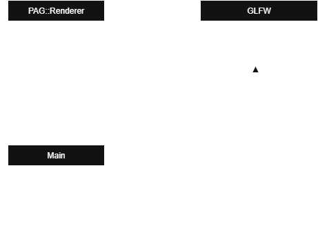

## Posible solución al problema planteado:

En esta práctica se plantea el problema de cómo encapsular la lógica de renderizado en una clase
(`PAG::Renderer`) y, al mismo tiempo, poder utilizar callbacks de GLFW.
La dificultad surge porque  GLFW exige que los callbacks sean **funciones globales** de estilo C, mientras que nosotros deseamos trabajar con **métodos de clase**.

Para encapsular el dibujado dentro de una clase, podemos crear la clase `PAG::Renderer`,  que contendrá el método `refrescaVentana()`.

### Propuesta de solución
1. Creamos el objeto `Renderer` en `main.cpp`.
2. Guardamos un puntero al objeto `Renderer` en la ventana GLFW mediante `glfwSetWindowUserPointer`.
3. Definimos un callback (`window_refresh_callback`) que recupera el puntero con `glfwGetWindowUserPointer`
   y llama a `renderer->refrescaVentana()`.

De este modo obtenemos un bajo acoplamiento:
-   Los callbacks de GLFW no dependen de la implementación interna de `Renderer`.
-   El callback es una función simple que solo conoce un puntero.
-   La clase `Renderer` se encarga de dibujar y refrescar la ventana.


### Diagrama UML




# Solución Practica 2

Partiendo de la practica anterior, procedemos a crear la clase Renderer, donde almacenaremos las llamadas a funciones OpenGL, para así desacoplar el código.

##  Cambios Realizados: 

### main.cpp
Solo mantendremos las llamadas a GLFW, mientras que las llamadas a OpenGL las realizaremos desde Renderer. 

```
glViewport(0, 0, anchoV, altoV);
glClearColor(color[0], color[1], color[2], 1.0f);
glClear(GL_COLOR_BUFFER_BIT | GL_DEPTH_BUFFER_BIT);
```
Estas operaciones, ahora las realizaremos desde Renderer::Refrescar() y Redimencionar(), quedando en nuestro main.cpp la llamada a Renderer.
```
PAG::Renderer::getInstancia().refrescar();
PAG::Renderer::getInstancia().redimencionar(ancho, alto);
```

### Callbacks
Procedemos a su vez a modificar aquellos callbacks que contaban con funciones de OpenGL.

-   **`window_refresh_callback`**: delega en `Renderer::getInstancia().refrescar()`.
    
-   **`framebuffer_size_callback`**: delega en `Renderer::getInstancia().redimencionar(width, height)`.
    
-   **`scroll_callback`**: ya no modifica un array de colores, sino que actualiza el color de fondo mediante `Renderer::setColorFondo(color)`.
    
-   **`mouse_button_callback`**: ahora comunica también los eventos de ratón a ImGui `io.AddMouseButtonEvent(button, true)`.


### Bucle principal
Ahora el bucle principal no mezclara OpenGl con la lógica de la interfaz.

```
 renderer.refrescar();      // Limpia la pantalla
 gui.dibuja();                          // Dibuja la interfaz gráfica
```

## ImGui
Finalmente podemos destacar la integracion del contexto ImGui en el main.cpp, de este modo, se delegan eventos de raton y del ciclo de eventos a ImGui. 

por ejemplo: 
```
void mouse_button_callback ( GLFWwindow *window, int button, int action, int mods ){  
    if ( action == GLFW_PRESS ){  
        ImGuiIO& io = ImGui::GetIO ();  
        io.AddMouseButtonEvent ( button, true );  
    }  
    else if ( action == GLFW_RELEASE ){  
        ImGuiIO& io = ImGui::GetIO ();  
        io.AddMouseButtonEvent ( button, false );  
    }  
  
}
```


### ¿Por qué el triángulo se deforma al redimensionar la ventana?

El triángulo se deforma al cambiar el tamaño de la ventana porque **no definimos
una proyección ni una matriz de transformación que mantenga la relación de aspecto**.

Actualmente, las coordenadas del triángulo se interpretan como `x` e `y` que va de `-1` a `1`.  
Al redimensionar la ventana, el *viewport* (`glViewport`) se ajusta al nuevo ancho y alto, pero OpenGL
simplemente estira esos valores para llenar todo el área de dibujo.

Esto provoca que si la ventana es más ancha que alta, el triángulo se **ensancha** y si la ventana es más alta que ancha, el triángulo se **aplasta en horizontal**.

La solución sería aplicar una **matriz de proyección** o bien ajustar
las coordenadas de dibujo en función del tamaño de la ventana.